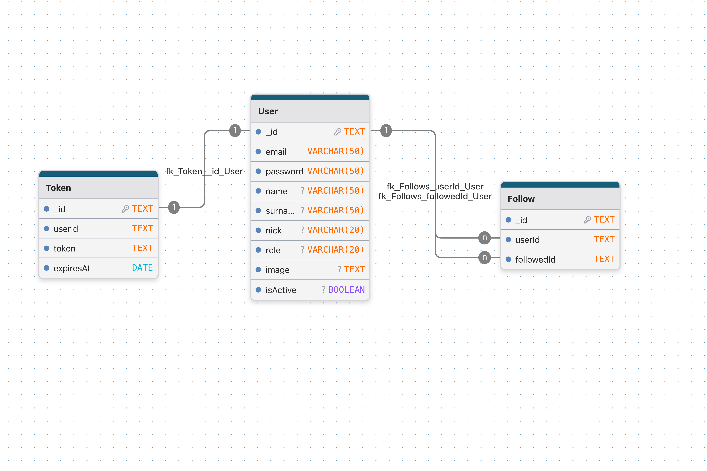
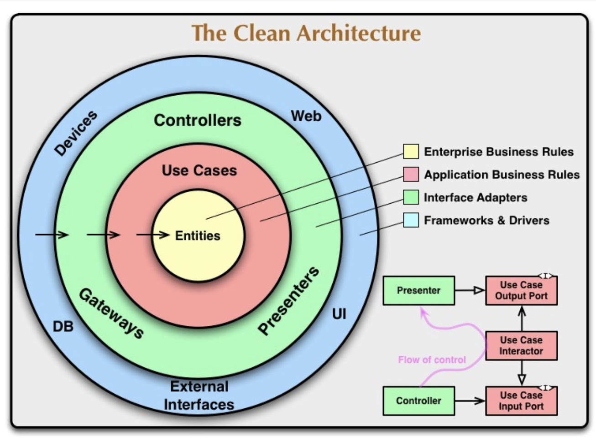
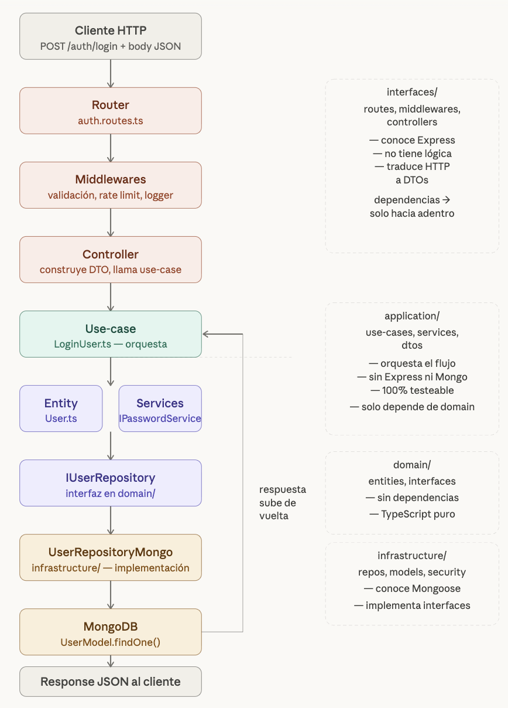

# Backed of Social Media

## Tools

```
Node JS
Typescript
Prettier
ESLint
MongoDB
Mongoose
Jest
Husky
Docker + docker-compose
Commitlint
```

## Schema of Database



## Schema of Clean Architecture



## Diagram of Clean Architecture



## Order in which the layers are processed

### 1º domain

```
1º entities
2º Repositories
```∏

### 2º Application

```
1º dtos
2º services
3º useCases
```

### 3º Infrastructure

```
1º models
2º repositories
3º security
```

### 4º interfaces

```
1º controllers
2º middlewares
3º routes
```
